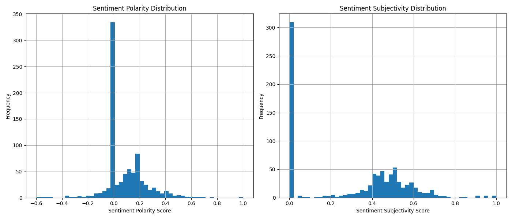
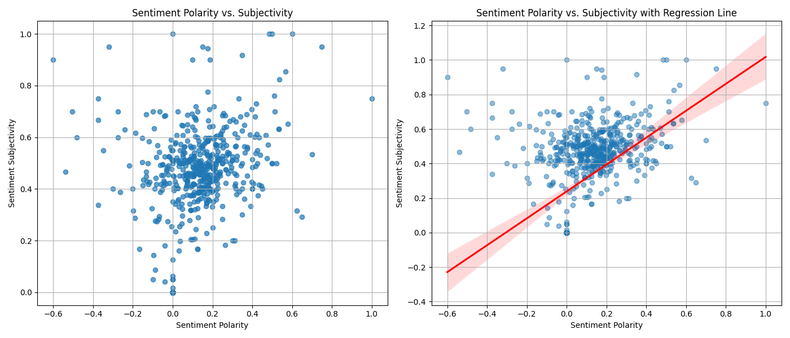

# Portfolio Project Paris 2024 Sentiment: Analyzing Public Opinion on Twitter and Reddit
The project explores public sentiment surrounding the Paris 2024 Olympic Games by analyzing discussions on Twitter and Reddit. It comprises three main components:

1. Twitter Data Collection: This script, found in the 'Twitter' folder, gathers tweets related to the Olympics.
2. Reddit Data Collection: This script, found in the 'Reddit' folder, extract posts from Reddit related to the Olympics.
3. Data Cleaning and Sentiment Analysis: This script processes and analyzes the collected data to determine overall sentiment and is located in the main directory.

## Twitter 
Twitter, now rebranded as X, is a social media platform where users can share and discover updates, news, and personal thoughts in short posts known as tweets. Twitter’s data retrieval using basic API version is far more complex and restrictive than Reddit, making it more challenging to gather relevant sentiment data. Due to the limited data retrieved from Twitter, I switched to the Reddit API and conducted sentiment analysis exclusively using Reddit posts.

### Prerequisites
Python 3.x installed on your system.
Install the required dependencies:

    pip install -r requirements.txt

### Configuration
To authenticate with the Twitter API, API keys, access tokens and a bearer token should be provided. These should be securely stored in a .env file in the root directory.
Twitter API credentials are stored as follows:

    API_KEY='api_key'
    API_KEY_SECRET='api_key_secret'
    ACCESS_TOKEN='access_token'
    ACCESS_TOKEN_SECRET='access_token_secret'
    BEARER_TOKEN='bearer_token'

### Usage
Run the script as follows:

    python twitter_fetch.py

### Twitter Data Extraction Tools
For the Twitter data collection process the Basic X API v2 and 'Tweepy' library were used. This API version allows search of recent tweets from the last 7 days that match the given search query, supporting up to 60 requests / 15 mins per app with a maximum of 100 results per response. The month limit for retrieving posts is 10000.

### Tweets Data Storage
I utilized SQLite as a database to manage and store tweet data. I used the SQLAlchemy library to interface with the SQLite database, which provides ORM (Object-Relational Mapping) framework for handling tweets.

### Tweets Fetching
Retweets were excluded from the database to ensure more accurate results of the sentiment analysis. Since tweets rarely include country, country_code, and place_id data, I chose not to collect this information. The user's location, which is commonly present, is sufficient for my purposes. The search query is:

    "olympics OR #olympics OR #olympics2024 OR paris 2024 OR #paris2024 OR olympic games OR #olympicgames OR olympic day OR #olympicday OR road to paris 2024 OR #roadtoparis2024 OR olympic 2024 OR #olympic2024 OR olympic OR #olympic OR summer olympics OR #summerolympics OR 2024 paris olympics OR #2024parisolympics OR paris olympics OR #parisolympics"

Due to excluded retweets, strict restrictions and a technical error in recording to the database, I managed to get only 330 posts and decided to switch to the Reddit API.

## Reddit 
Reddit is a popular social platform, where users post content in different topic-specified communities named 'subreddits'. Moreover, it contains advanced sorting options - such as hot, top, new, relevant and comments. Both these tools facilitate more advanced data search and sentiment analysis. Reddit API is widely used by users for sentiment analysis projects. 

### Prerequisites
Python 3.x installed on your system.
Install the required dependencies:

    pip install -r requirements.txt

### Configuration
To authenticate with the client is, client secret and a user agent should be provided, which should be securely stored in a .env file in the root directory.
Reddit API credentials are stored as follows:

    CLIENT_ID = 'client_id'
    CLIENT_SECRET = 'client_secret'
    USER_AGENT = 'user_agent'

### Usage
Run the script as follows:

    reddit_fetch.py [-h] [--query [QUERY]] [--subreddit SUBREDDIT] [--sort SORT] [--time TIME]

    Command Line Interface Arguments:
    --query [QUERY]         If used without a value, is set to a default query. When this argument is absent,
                            the reddit search is performed globally not based on a query match.
    --subreddit SUBREDDIT   Can be set to the subreddit name. Default value is "olympics".
    --sort SORT             Can be set to "hot", "top", "new", "relevant", "comments".  Default value is "new".
    --time TIME             Can be set to , "hour", "day", "week", "month", "year", "all".  Default value is "month".

### Reddit Posts Extraction Tools
Reddit posts were collected with use of Reddit API free version and 'PRAW' library, which allows to fetch up to 250 most recent posts per response based on the sort parameters provided.

### Reddit Posts Storage
For the Reddit component, a similar approach is used to manage and store post data from Reddit. I again used SQLite with SQLAlchemy for ORM functionality.

### Reddit Posts Fetching
Reddit posts were searched through using several 'PRAW' functions. First, search was performed using 'subreddit.search' function which searches by a given key-word query with different sorting parameters('hot', 'top', 'new', 'relevant', 'comments'). Posts were searched both in an 'all' subreddit and in a subreddit named 'olympics'. The query was:

    "olympics OR #olympics OR #olympics2024 OR paris 2024 OR #paris2024 OR olympic games OR #olympicgames OR olympic day OR #olympicday OR road to paris 2024 OR #roadtoparis2024 OR olympic 2024 OR #olympic2024 OR olympic OR #olympic OR summer olympics OR #summerolympics OR 2024 paris olympics OR #2024parisolympics OR paris olympics OR #parisolympics"

Then, posts were fetched only from  'olympics' subreddit using 'subreddit.top', 'subreddit.hot', 'subreddit.new' functions, which search globally not based on a query match .
The time filter was set to 'month', 'year' and 'all', but it was decided to exclude posts that were created before 22.07.2024 within the data cleaning.
I fetched 1898 reddit posts in total.

## Data Cleaning and Sentiment Analysis
Due to insufficient Twitter data, the sentiment analysis focused solely on Reddit posts.

### Prerequisites
Python 3.x installed on your system.
Install the required dependencies:

    pip install -r requirements.txt

### Usage
Run the script as follows:

    python data_analysis.py

### Data Cleaning
The data cleaning process utilized the Pandas library and involved the following steps:

1. Date Filtering: Posts created before July 22, 2024, were excluded to ensure the relevance of the data.
2. Keyword Filtering: Posts lacking the terms "Paris" or "2024" in their 'title' or 'text' fields were removed. This step also filtered out posts with both 'title' and 'text' fields empty.

### Sentiment Analysis
Sentiment analysis was conducted using the TextBlob library, with visualizations produced using Seaborn and Matplotlib. The analysis provided insights into the general sentiment expressed in Reddit posts about the Paris 2024 Olympics. The findings from this analysis are as follows: 

### References
[1]: Tweepy Documentation. Available at: https://docs.tweepy.org/en/stable

[2]: Parack, Suhem; Monticone, Pietro; Piper, Andy; Shaikh, Moin; Garcia, David. "Getting started with the Twitter API v2 for academic research." Available at: https://github.com/xdevplatform/getting-started-with-the-twitter-api-v2-for-academic-research

[3]: X Developer Platform. "Search Tweets. Introduction." Available at: https://developer.x.com/en/docs/twitter-api/tweets/search/introduction

[4]: X Developer Platform. "Search Tweets. Building queries for Search Posts." Available at: https://developer.x.com/en/docs/twitter-api/tweets/search/integrate/build-a-query#boolean

[5]: X Developer Platform. "Search Tweets. Recent search pagination." Available at: https://developer.x.com/en/docs/twitter-api/tweets/search/integrate/paginate

[6]: X Developer Platform. "Twitter API v2 data dictionary. Place." Available at: https://developer.x.com/en/docs/twitter-api/data-dictionary/object-model/place

[7]: X Developer Platform. "Twitter API v2 data dictionary. User." Available at: https://developer.x.com/en/docs/twitter-api/data-dictionary/object-model/user

[8]: X Developer Platform. "Twitter API v2 data dictionary. Tweet." Available at: https://developer.x.com/en/docs/twitter-api/data-dictionary/object-model/tweet

[9]: PRAW 7.7.1 documentation. "Authenticating via OAuth" Available at: https://praw.readthedocs.io/en/stable/getting_started/authentication.html

[10]: PRAW 7.7.1 documentation. "Subreddit." Available at: https://praw.readthedocs.io/en/stable/code_overview/models/subreddit.html

[11]: Stackoverflow. "How to open and convert sqlite database to pandas dataframe." Available at: https://stackoverflow.com/questions/36028759/how-to-open-and-convert-sqlite-database-to-pandas-dataframe

[12]: Pandas. "Pandas.to_datetime". Available at:  https://pandas.pydata.org/docs/reference/api/pandas.to_datetime.html

[13]: Pandas. "Pandas.Series.str.contains". Available at: https://pandas.pydata.org/docs/reference/api/pandas.Series.str.contains.html

[14]: TextBlob. "Tutorial: Quickstart". Available at: https://textblob.readthedocs.io/en/dev/quickstart.html